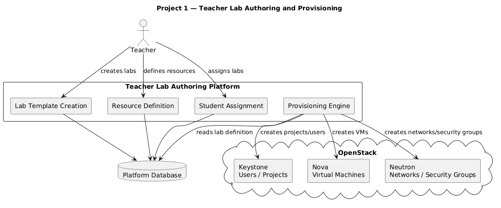

# Project 1 — Teacher Lab Authoring and Provisioning

## Project Context

Cloud computing education requires practical laboratories where students can work with real infrastructure concepts such as:

- Virtual machines
- Networks
- Subnets
- Routers
- Security groups
- Images
- Cloud projects
- Resource provisioning

Public cloud providers such as AWS, Azure, and Google Cloud are often used for teaching, but they may introduce problems such as:

- Cost
- Vendor dependence
- Account management complexity
- Limited institutional control
- Difficulty reproducing environments

This project contributes to an alternative approach: using **OpenStack** as a self-hosted academic cloud platform.

OpenStack provides the infrastructure capabilities, but it does not directly provide a teacher-friendly educational layer for creating and assigning cloud laboratories. This project aims to build that layer.

---

## Main Objective

Develop a system that allows teachers to define cloud laboratory activities and provision the required resources in OpenStack.

The platform should allow teachers to:

- Create laboratory templates
- Define required OpenStack resources
- Assign laboratories to students
- Create OpenStack projects and users when needed
- Provision virtual machines, networks, and security groups
- Manage the lifecycle of laboratory environments

---

## Problem Statement

Teachers need a simple way to create and manage practical cloud computing laboratories.

Without a dedicated platform, teachers may need to manually create OpenStack resources, configure student access, prepare instructions, and verify whether each environment is ready. This can become difficult when working with many students.

This project aims to solve that problem by creating a teacher-facing platform for laboratory authoring and provisioning.

---

## Example Scenario

A teacher wants to create a laboratory called:

```text
Basic OpenStack Networking Lab
```

The teacher defines that each student should receive:

- One private network
- One subnet
- One router
- One virtual machine
- One security group allowing SSH access

The platform should use this definition to prepare or provision the required OpenStack resources for each assigned student or group.

---

## Expected Teacher Workflow

```text
Teacher logs in
        │
        ▼
Creates a new laboratory
        │
        ▼
Defines instructions and objectives
        │
        ▼
Defines required OpenStack resources
        │
        ▼
Assigns the lab to students
        │
        ▼
Platform provisions the lab environment
        │
        ▼
Students can access the laboratory
```

---

## Main Features

## 1. Laboratory Template Creation

Teachers should be able to create reusable laboratory templates.

A lab template may include:

- Lab title
- Lab description
- Learning objectives
- Difficulty level
- Estimated duration
- Required resources
- Tasks to be completed
- Initial configuration scripts, if needed

Example:

```yaml
lab:
  title: "Basic OpenStack Networking Lab"
  difficulty: "Beginner"
  duration: "90 minutes"

resources:
  networks:
    - name: "student-private-network"
      subnet: "192.168.10.0/24"

  instances:
    - name: "student-vm"
      image: "ubuntu-22.04"
      flavor: "small"

security_groups:
  - name: "allow-ssh"
    rules:
      - protocol: "tcp"
        port: 22
```

---

## 2. Resource Definition

The platform should allow teachers to define which OpenStack resources are needed for a laboratory.

Possible resources include:

- OpenStack projects
- OpenStack users
- Virtual machines
- Images
- Flavors
- Networks
- Subnets
- Routers
- Security groups
- Floating IPs
- Volumes

The first version does not need to support every OpenStack resource. It should focus on the most important resources for beginner and intermediate cloud computing laboratories.

---

## 3. OpenStack Project and User Creation

The system should support the creation or management of OpenStack projects and users.

This is important because each student or group may need an isolated environment.

Possible approaches:

- One OpenStack project per student
- One OpenStack project per group
- One shared project with naming conventions
- Pre-created users and projects imported into the platform

The final approach can be decided during the analysis phase.

---

## 4. VM, Network, and Security Group Provisioning

The platform should communicate with OpenStack to create and manage resources such as:

- Virtual machines
- Private networks
- Subnets
- Routers
- Security groups
- Floating IPs

For example, the platform should be able to create a student virtual machine and attach it to a private network.

---

## 5. Lab Assignment to Students

Teachers should be able to assign a laboratory to:

- Individual students
- Groups of students
- A full class

The system should store which students have access to which laboratory.

---

## 6. Lab Lifecycle Management

The platform should support basic laboratory lifecycle operations.

Examples:

- Create lab environment
- Start lab environment
- Stop lab environment
- Reset lab environment
- Delete lab environment
- Check lab status

---

## Expected Architecture



---

## Integration With Project 2

This project should integrate with **Project 2 — Student Laboratory Portal**.

Project 1 is responsible for creating and provisioning laboratories.

Project 2 is responsible for allowing students to access those laboratories.

The two projects should agree on shared concepts such as:

- Student
- Teacher
- Course
- Laboratory
- Task
- Assignment
- Lab status
- OpenStack project
- OpenStack resource

Example integration flow:

```text
Project 1 creates and assigns a lab
        │
        ▼
Project 2 displays the lab to the student
        │
        ▼
Student starts or opens the lab
        │
        ▼
Project 1 provisions or manages resources
        │
        ▼
Project 2 shows progress and access information
```

---

## Example Final Demonstration

The final demonstration could show:

```text
Teacher creates a lab
        │
        ▼
Teacher defines required OpenStack resources
        │
        ▼
Teacher assigns the lab to a student
        │
        ▼
Platform provisions the environment in OpenStack
        │
        ▼
Student lab is ready to be accessed through Project 2
```

---
## Success Criteria

The project will be considered successful if:

- A teacher can create a laboratory
- A teacher can define required resources
- A teacher can assign the lab to students
- The system can communicate with OpenStack
- The system can provision at least one working lab environment
- The lab can be made available to the student portal
- The code is understandable and documented
- The project can be extended by future students
