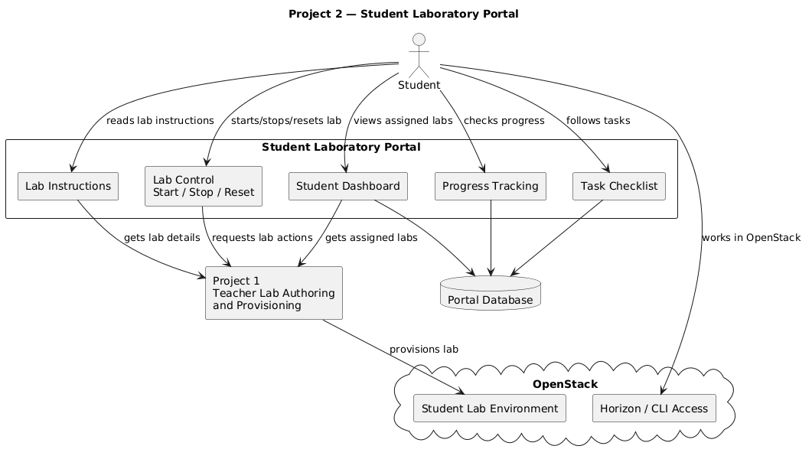

# Project 2 — Student Laboratory Portal

## Project Context

Cloud computing is a practical subject. Students need to work with real or realistic cloud environments in order to understand concepts such as:

- Virtual machines
- Networks
- Subnets
- Routers
- Security groups
- Cloud images
- Resource provisioning
- Infrastructure troubleshooting

OpenStack provides the cloud environment for this research project. However, OpenStack by itself is not designed as a student learning portal.

A student may be able to use OpenStack Horizon or the OpenStack CLI, but they also need a structured educational interface that shows:

- Which labs are assigned
- What tasks must be completed
- What the objectives are
- Whether the lab has started
- Whether the lab is completed
- What progress has been made

This project aims to build that student-facing educational interface.

---
## Main Objective

Develop a **Student Laboratory Portal** where students can access their assigned cloud laboratories and follow their progress.

The portal should allow students to:

- View assigned laboratories
- Read laboratory instructions
- Start, stop, or reset their lab environment
- View a checklist of tasks
- Track progress
- See submission or completion status
- Access OpenStack resources or links related to the lab

---

## Problem Statement

In practical cloud computing courses, students often receive lab instructions in documents, while the actual cloud work happens in a separate platform such as OpenStack.

This separation can make it difficult for students to know:

- Which lab they should complete
- Which tasks are required
- Whether their environment is ready
- Whether they completed the expected work
- What remains to be done
- Whether their work was submitted or completed

This project aims to solve that problem by creating a clear student portal for laboratory access and progress tracking.

---

## Example Scenario

A student logs in and sees an assigned lab called:

```text
Basic OpenStack Networking Lab
```

The student opens the lab and sees the following tasks:

1. Create a private network
2. Create a subnet
3. Create a router
4. Launch a virtual machine
5. Configure a security group that allows SSH access

The student starts the lab, works in OpenStack, and uses the portal to follow progress and check completion status.

---

## Expected Student Workflow

```text
Student logs in
        │
        ▼
Views assigned laboratories
        │
        ▼
Opens a laboratory
        │
        ▼
Reads instructions and objectives
        │
        ▼
Starts the lab environment
        │
        ▼
Completes practical tasks in OpenStack
        │
        ▼
Checks task progress
        │
        ▼
Submits or completes the laboratory
```

---

## Main Features

## 1. Student Dashboard

Students should have a dashboard where they can see:

- Assigned laboratories
- Not started labs
- In-progress labs
- Completed labs
- Deadlines, if applicable
- Basic progress information

Example:

```text
My Laboratories

[Not Started]  Basic OpenStack Networking Lab
[In Progress]  Virtual Machine Provisioning Lab
[Completed]    Security Groups and SSH Access Lab
```

---

## 2. Laboratory Instructions

Each laboratory should have a page with clear instructions.

The instructions may include:

- Lab title
- Description
- Learning objectives
- Estimated duration
- Prerequisites
- Step-by-step tasks
- Expected outcome
- Useful commands
- Links to OpenStack Horizon or documentation

Example:

```text
Lab Objective:
Learn how to create a private network, connect it to a router, and launch a virtual machine inside that network.
```

---

## 3. Start, Stop, and Reset Lab

The portal should allow students to manage their laboratory environment.

Possible actions:

- Start lab
- Stop lab
- Reset lab
- Open lab
- Submit lab

The exact behavior should be coordinated with **Project 1 — Teacher Lab Authoring and Provisioning**, because Project 1 manages the actual provisioning logic.

---

## 4. Task Checklist

Students should see a checklist of tasks to complete.

Example:

```text
[ ] Task 1 — Create a private network
[ ] Task 2 — Create a subnet
[ ] Task 3 — Create a router
[ ] Task 4 — Launch a virtual machine
[ ] Task 5 — Configure SSH access
```

The checklist should show whether each task is:

- Not started
- In progress
- Completed
- Failed validation
- Waiting for validation

---

## 5. Progress View

The portal should show progress at the lab level and task level.

Possible progress indicators:

- Percentage completed
- Number of completed tasks
- Number of remaining tasks
- Lab status
- Last activity time
- Completion timestamp

Example:

```text
Progress: 3 / 5 tasks completed
Status: In progress
Last activity: 14:35
```

---

## 6. Submission and Completion Status

The portal should allow students to know whether the lab is completed or submitted.

Possible statuses:

- Not started
- Started
- In progress
- Submitted
- Completed
- Failed
- Needs review

The first version can use simple statuses and later versions can support more advanced evaluation.

---

## 7. Access to OpenStack

Students may need access to OpenStack through:

- OpenStack Horizon dashboard
- OpenStack CLI
- Links to their assigned project/environment
- Credentials or access instructions
- Connection details for virtual machines

The portal should clearly explain how the student accesses the cloud environment.

---

## Expected Architecture



---

## Integration With Project 1

This project should integrate with **Project 1 — Teacher Lab Authoring and Provisioning**.

Project 1 is responsible for:

- Creating labs
- Defining lab resources
- Assigning labs to students
- Provisioning OpenStack environments

Project 2 is responsible for:

- Showing assigned labs to students
- Displaying instructions
- Allowing students to start, stop, or reset labs
- Showing task progress
- Showing completion status

Example integration flow:

```text
Project 1 creates and assigns a lab
        │
        ▼
Project 2 displays the lab to the student
        │
        ▼
Student starts the lab in Project 2
        │
        ▼
Project 1 provisions or activates the environment
        │
        ▼
Project 2 shows that the lab is ready
```

---

## Future Integration With Analytics

Although this project is mainly focused on the student portal, it should be designed so that future telemetry and analytics can be added.

For example, the portal may later generate events such as:

```json
{
  "student_id": "student-001",
  "lab_id": "networking-basic-01",
  "event_type": "lab_started",
  "timestamp": "2026-10-14T14:00:00Z"
}
```

Possible future events include:

- Lab started
- Lab opened
- Task viewed
- Task marked as completed
- Lab submitted
- Lab reset
- Hint requested

These events may later support learning analytics and AI-supported feedback.

---

## Example Final Demonstration

The final demonstration could show:

```text
Student logs in
        │
        ▼
Student sees assigned lab
        │
        ▼
Student opens lab instructions
        │
        ▼
Student starts the lab
        │
        ▼
Student sees task checklist
        │
        ▼
Student completes tasks
        │
        ▼
Student sees progress and completion status
```

---

## Success Criteria

The project will be considered successful if:

- A student can log in
- A student can view assigned labs
- A student can open lab instructions
- A student can start or access a lab environment
- A student can see a task checklist
- A student can track progress
- A student can see lab completion status
- The portal integrates with Project 1
- The code is understandable and documented
- The project can be extended by future students
